<p align="center">
  
</p>

<h1 align="center">Trekker</h1>

<p align="center">
  A self-hosted tracker for the series and films you watch.<br />
  Knows what's next, what's landing, where it's streaming, and what's on your own Plex.
</p>

<p align="center">
  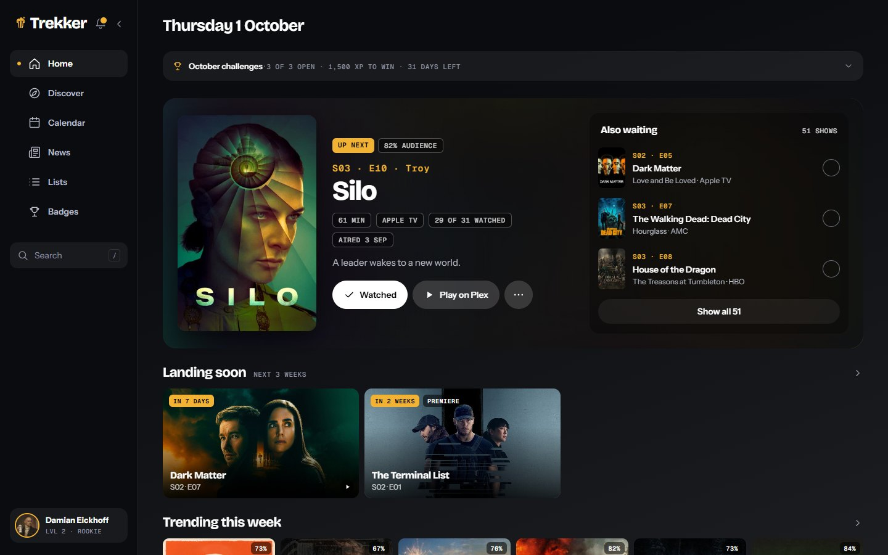
</p>

<p align="center">
  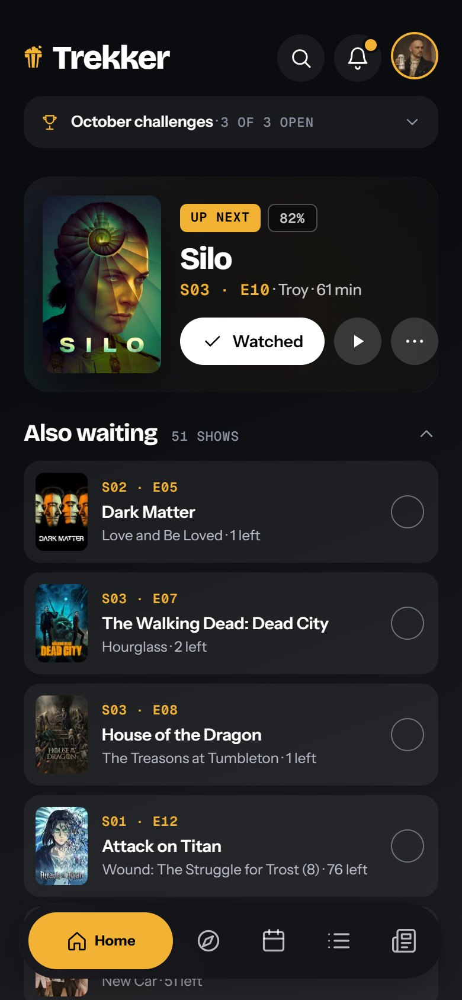
  &nbsp;
  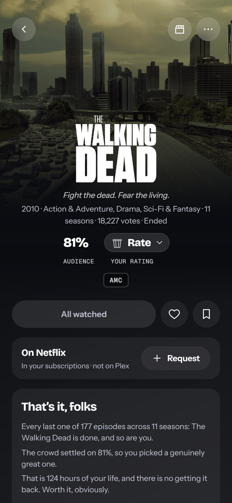
  &nbsp;
  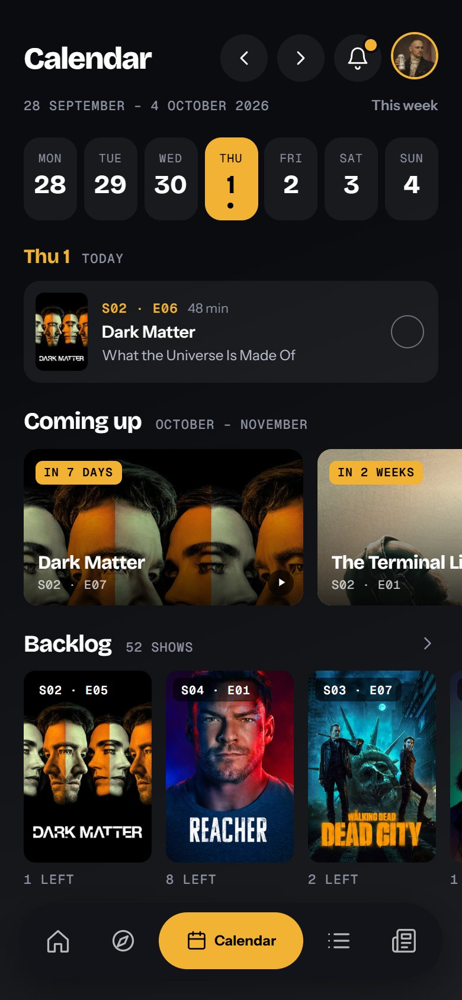
  &nbsp;
  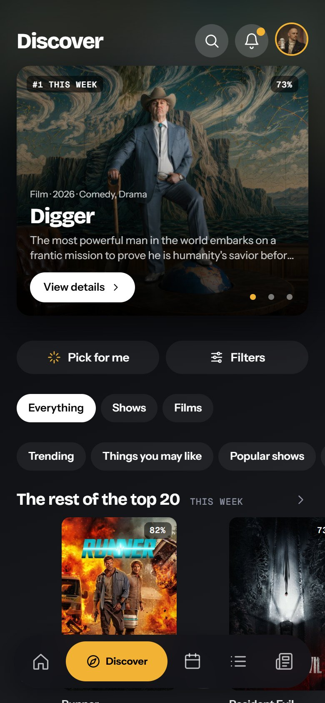
</p>

Trekker is for a household that watches a lot and wants one place that
remembers it all: where you are in every show, what airs this week, what you
thought of it, and what to put on tonight. It runs as a single container with a
SQLite file, installs to a phone's home screen as an app, and plugs into Plex,
Overseerr and Trakt if you have them.

The catalogue comes from [TMDB](https://www.themoviedb.org/). Everything else,
your history, lists, ratings and friends, stays in your database.

### At a glance

- **[Up next](#up-next-without-thinking-about-it)**: the next episode of every show, one tap to mark it watched
- **[Calendar](#a-calendar-of-whats-airing)**: what airs this week, what's coming, and your backlog
- **[Title pages](#title-pages-worth-opening)**: series, films, episodes and people, with popcorn ratings, comments and your viewings
- **[Discover and What to watch](#discover-and-a-hand-picking-tonights-watch)**: the week's top titles, rails and filters, and four questions to pick tonight's watch
- **[Lists](#lists-including-ones-that-keep-themselves)**: a watchlist, favourites, your own lists and smart lists that rebuild every night
- **[Your numbers](#your-numbers)**: time watched, streaks, hours per year, and a year in review
- **[Badges and challenges](#badges-levels-and-monthly-challenges)**: XP, levels, 62 badges and three challenges a month
- **[News](#news-about-what-you-follow)**: renewals, casting, dates and trailers for what you follow
- **[Friends](#friends)**: shared profiles, recommendations, and who in the house has seen what
- **[Plex, Overseerr and Trakt](#plex-overseerr-and-trakt)**: sign in with Plex, automatic logging, requests and Trakt import
- **[On your phone](#made-for-the-phone-too)**: an installable app with push notifications
- **[And more](#and-a-few-more)**: light and dark themes, backgrounds, a screensaver, search
- **[Running it](#running-it)**: Docker Compose, Unraid or from source

---

## What it does

### Up next, without thinking about it

Home opens on the next episode you're due, with **Watched** and **Play on Plex**
one tap away. Under it, every other show that has something waiting, the
episodes landing in the next three weeks, and what you've watched lately.
Tick an episode and the row moves on to the next one in place.

`/waiting` lists everything still to watch, with the hours it adds up to and
sorts for most left, recently aired or A–Z.

### A calendar of what's airing

The week at a glance, today highlighted, then a rail of what's coming over the
next two months and your backlog of shows with episodes to catch up on.

<p align="center">
  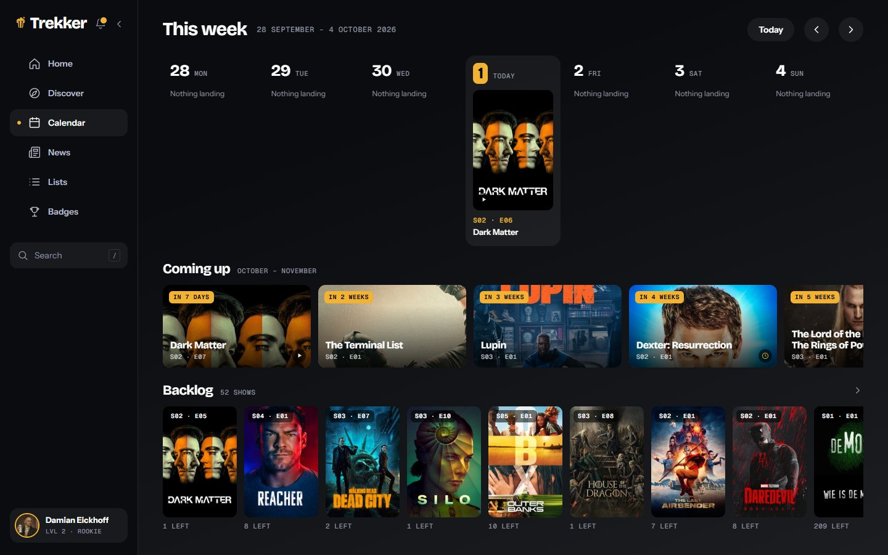
</p>

### Title pages worth opening

Every series, season, episode, film and person has its own page: the artwork,
the cast, where it streams in your region and whether it's already on your
Plex. On a series you tick off episodes a season at a time; finish one and
Trekker tells you what it cost you.

<p align="center">
  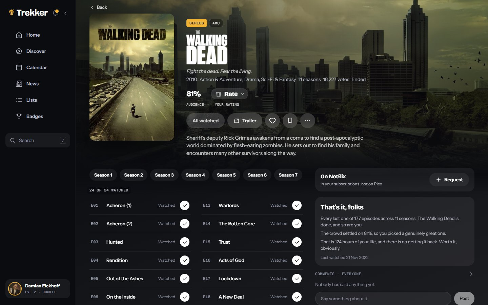
</p>

<table>
  <tr>
    <td>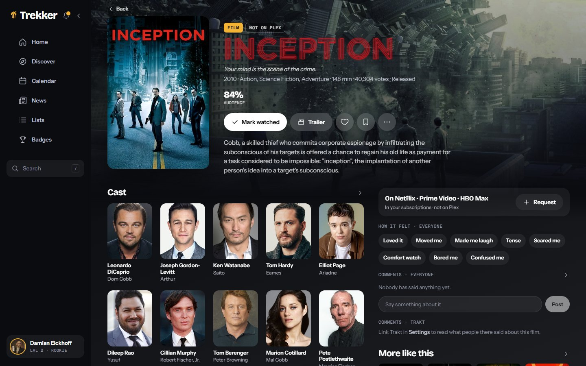</td>
    <td>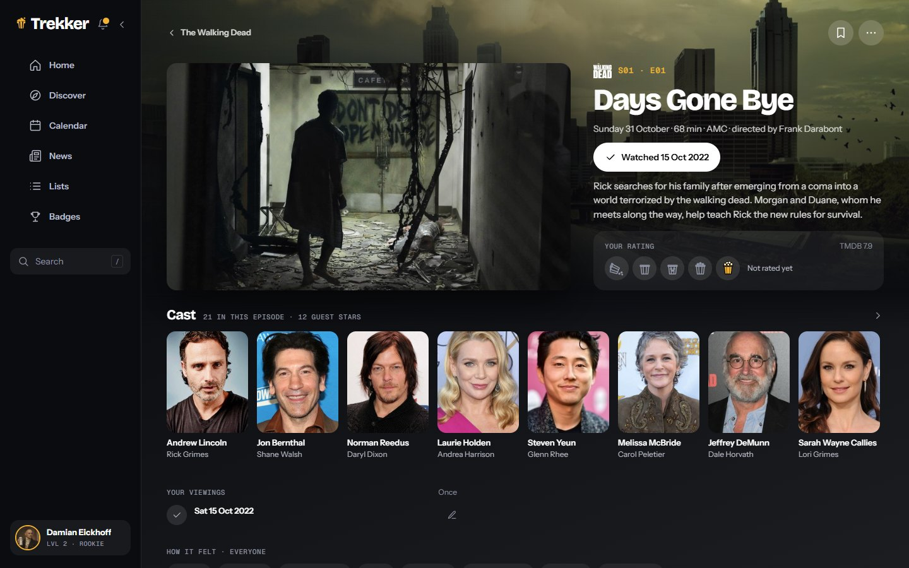</td>
  </tr>
  <tr>
    <td align="center"><sub>A film: cast, services, How it felt, comments</sub></td>
    <td align="center"><sub>An episode: guest stars, your viewings, popcorn rating</sub></td>
  </tr>
</table>

- **Popcorn ratings**, one to five buckets, for titles and single episodes.
- **How it felt**: tap a feeling (Loved it, Tense, Made me laugh…) and see
  what everyone else picked.
- **Your viewings**: every time you watched something, when, where (Plex,
  Netflix, the cinema) and a note about it. Rewatches count.
- **Comments** on films, shows and individual episodes, plus the most-liked
  comments from Trakt, with spoilers veiled until you've seen it.
- **Friends who watched**: who in the house has seen it and how far they got.
- **People**: a filmography you can filter to what you've seen, haven't, or
  can stream right now. Follow someone to get their news.

<p align="center">
  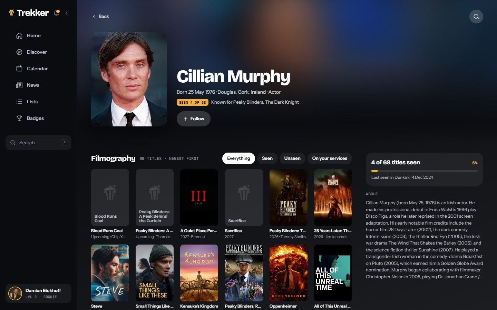
</p>

### Discover, and a hand picking tonight's watch

Discover opens on the week's top five as a carousel, then rails for trending,
things you may like, popular shows and films, new releases, what's in cinemas,
what's on the horizon and the hall of fame. Filter by genre, service, year,
runtime and score, and hide what you've already seen or saved.

Can't decide? **What to watch** asks four questions (who's watching, film or
series, the mood, how much time you have) and gives you a shortlist, with
what's on your Plex or your services first.

<table>
  <tr>
    <td>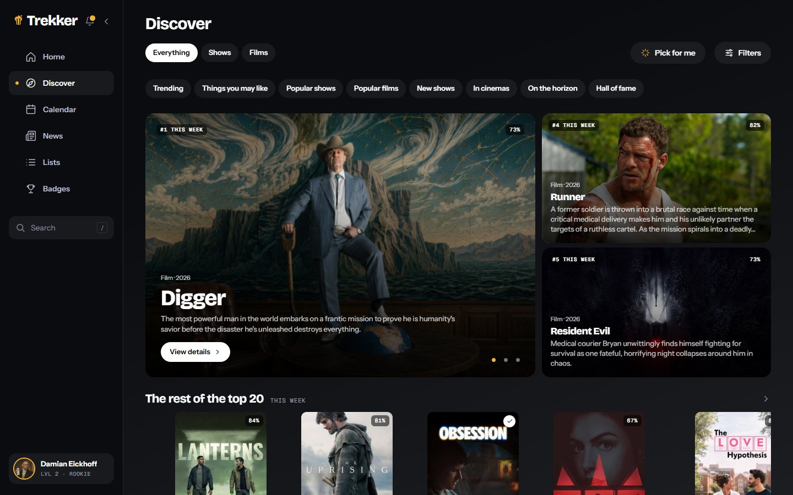</td>
    <td>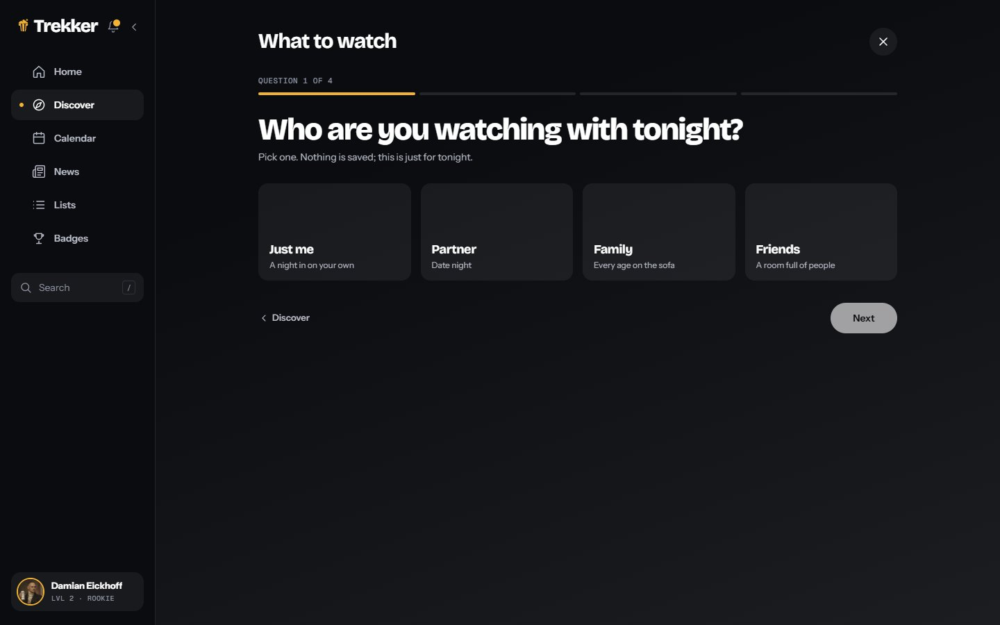</td>
  </tr>
</table>

### Lists, including ones that keep themselves

A watchlist (sortable by what's streaming now, shortest, best rated), your
favourites, lists of your own, and **smart lists**: describe the rule once,
say horror films from the 2010s on Netflix scoring over 70%, and Trekker
rebuilds it every night.

<p align="center">
  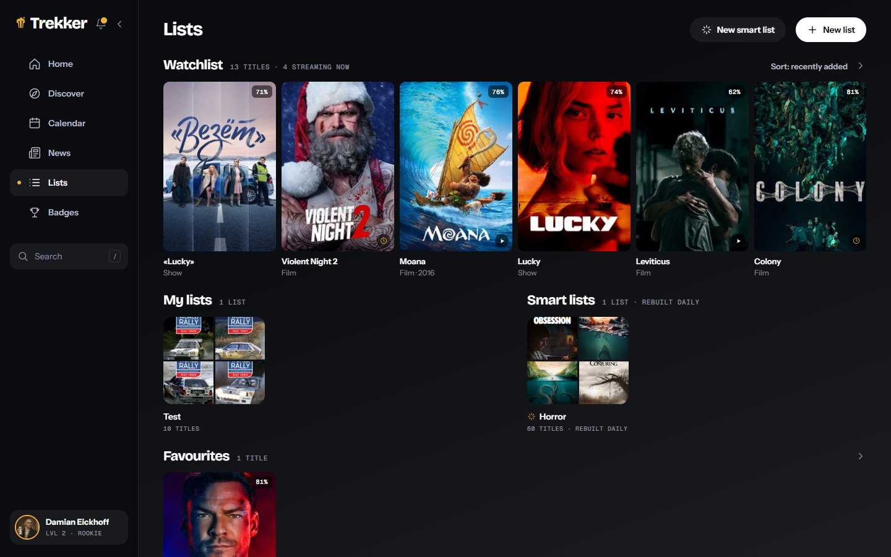
</p>

### Your numbers

Your profile adds it all up: total time watched, TV against film, streaks, and
your hours per year across your whole history. **Your review** is a
year-in-review (or month) you can scroll through: hours, busiest day, the show
of the year, the films you finally got round to.

<table>
  <tr>
    <td>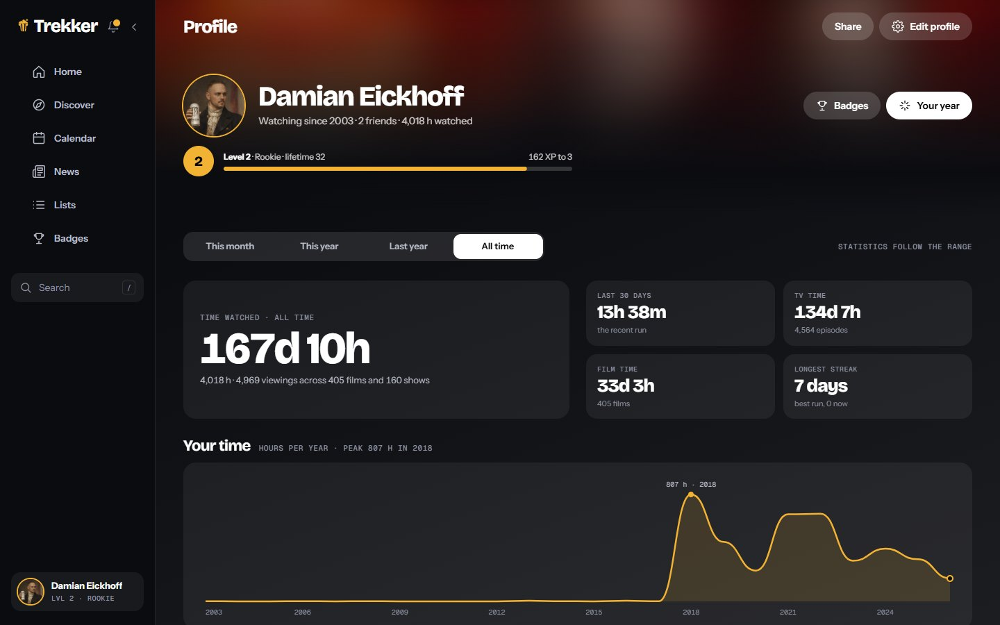</td>
    <td>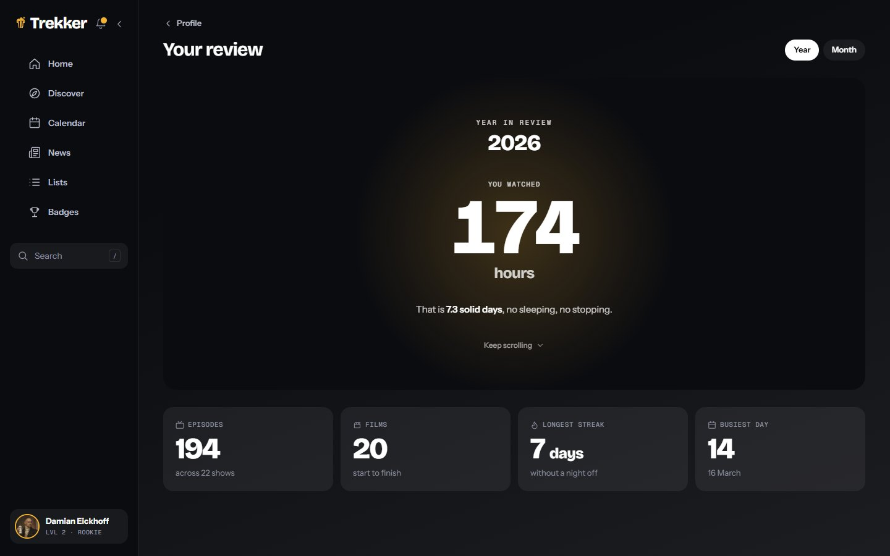</td>
  </tr>
</table>

### Badges, levels and monthly challenges

Watching earns XP. Sixty-two badges across milestones, habits, seasonal ones,
taste, completing franchises (every Marvel film, every Fast & Furious) and
people. Three new challenges every month.

<table>
  <tr>
    <td width="70%">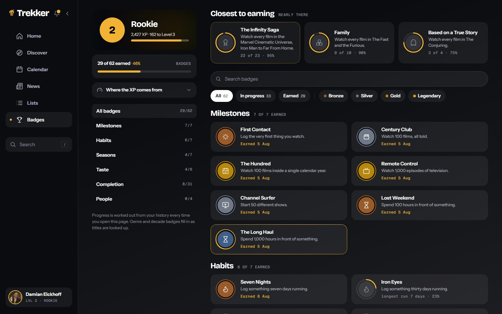</td>
    <td width="30%">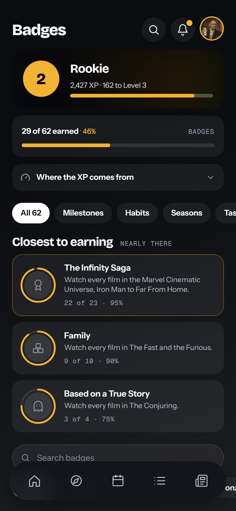</td>
  </tr>
</table>

### News about what you follow

A News page built like a news app: stories about the shows, films and people
you follow (renewals, casting, release dates, trailers) alongside headlines
from entertainment sites, filterable by kind. You choose the sources, can add
your own RSS feeds, and can turn on push for the things you care about.

<table>
  <tr>
    <td width="70%">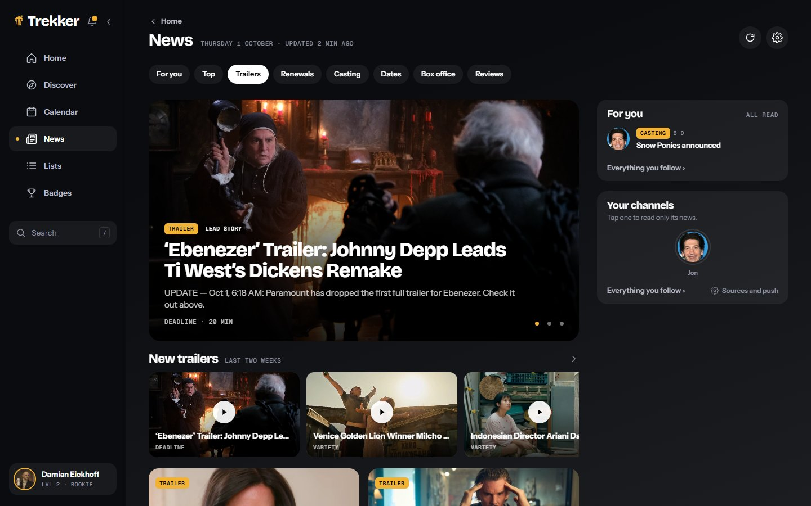</td>
    <td width="30%">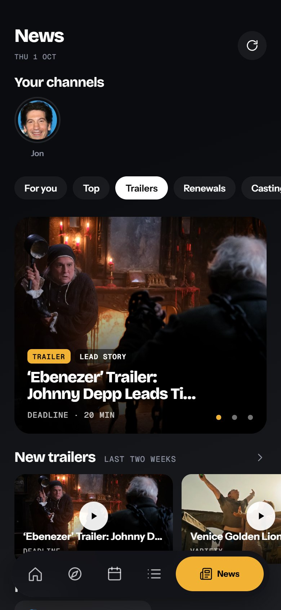</td>
  </tr>
</table>

### Friends

Everyone on the server can be friends: see each other's profiles, recommend a
title to someone, and get a nudge when they do. Profiles stay private until
both sides accept.

### Plex, Overseerr and Trakt

All optional, all set up from Settings.

- **Plex**: sign in with Plex (Plex Home profiles included, with "Who is
  watching?"), see which titles are on your server, play from Trekker, and
  have everything you watch on Plex logged automatically through the webhook.
  A sync pass catches anything the webhook missed.
- **Overseerr / Jellyseerr**: request a missing title from its page, see
  what's been requested, and get a notification when it lands on Plex (so does
  anyone who has it on their watchlist).
- **Trakt**: import your whole history with a username or an export file, and
  read Trakt's comments under films and episodes.

### Made for the phone too

Trekker is a PWA: add it to your home screen and it opens like an app, with a
floating tab bar, artwork running under the notch, and a cached shell that
paints straight away (about 50 ms on a warm launch). Push notifications cover
what airs today, friend requests and recommendations, new monthly challenges,
requests arriving on Plex, and news.

<p align="center">
  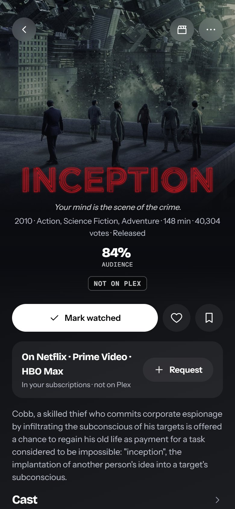
  &nbsp;
  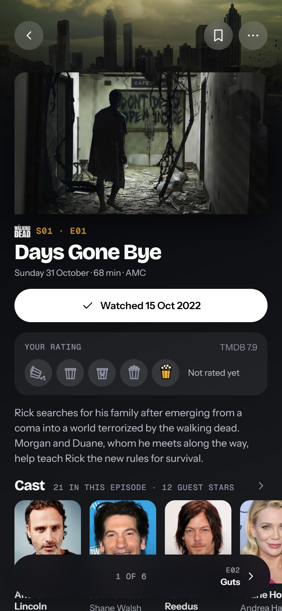
  &nbsp;
  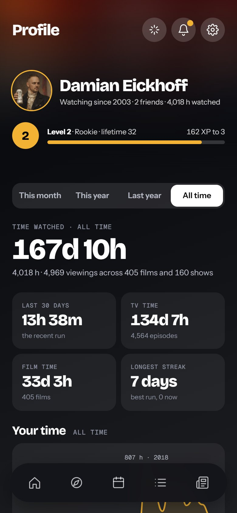
  &nbsp;
  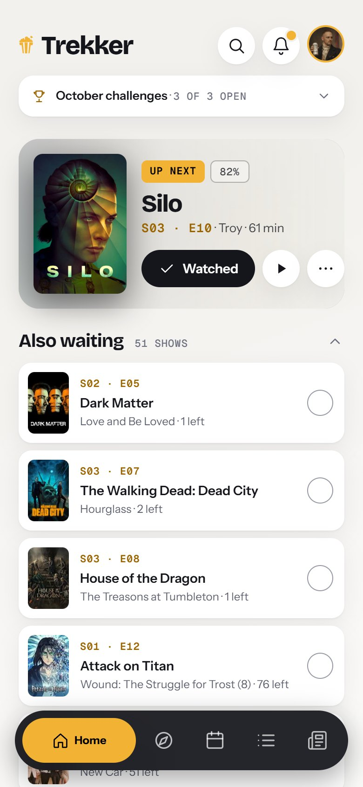
</p>

### And a few more

- **Light and dark themes**, plus a choice of page backgrounds: plain,
  gradient, artwork from your history, or a colour.
- **A screensaver** for the living-room screen: backdrops from your history
  and watchlist, the clock, the weather and what's up next.
- **Search** across series, films and people.
- **Every page is fast** because it renders from your database, not from TMDB;
  a background job keeps the catalogue fresh.

<p align="center">
  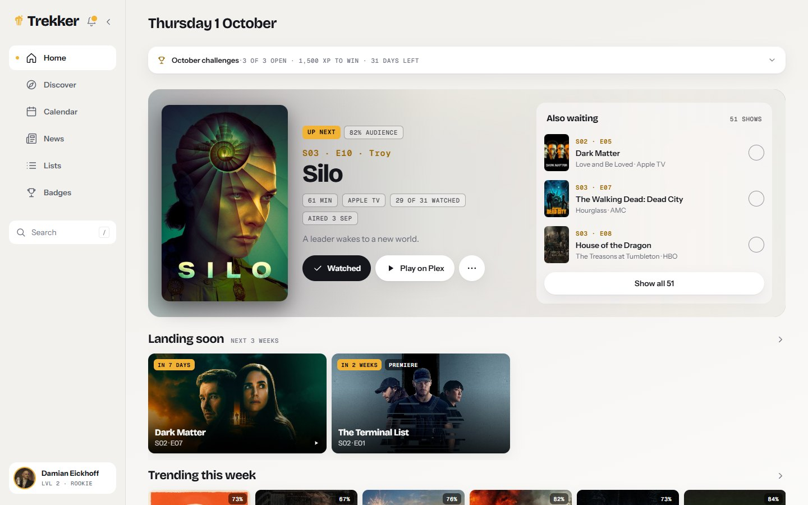
</p>

---

## Running it

You need a free [TMDB API key](https://www.themoviedb.org/settings/api), a
Plex account to sign in with, and somewhere to run a container.

### Docker Compose

```sh
git clone https://github.com/damianeickhoff/Trekker.git
cd Trekker
cp .env.example .env    # set AUTH_SECRET and TMDB_API_KEY at the very least
docker compose up -d
```

Open <http://localhost:3000> and choose **Continue with Plex**. Signing in with
Plex creates your account; there is no separate sign-up. The first account is
the admin, which picks the Plex server and links Overseerr in Settings. Everyone
else in your Plex Home gets their own account the same way, and the household
starts out as friends.

The database lives in the `trekker-data` volume at `/data/trekker.db`.
Migrations run on every start, so updating is `git pull && docker compose up -d
--build`.

### Unraid

A ready image is published to `ghcr.io/damianeickhoff/trekker:latest` on every
push to `main`. There's a template and step-by-step notes in
[`unraid/`](unraid/README.md).

### Configuration

Everything is an environment variable; [`.env.example`](.env.example) explains
each one.

| Variable | Needed | What for |
| --- | --- | --- |
| `AUTH_SECRET` | yes | Signs sessions and seals stored credentials. 32+ random characters. Keep it stable. |
| `TMDB_API_KEY` | yes | The catalogue. A v3 key or a v4 read token. |
| `DATABASE_URL` | yes | Already set in the container (`file:/data/trekker.db`). |
| `WATCH_REGION` | | Default streaming region, e.g. `GB`, `NL`, `US`. Each person can change theirs. |
| `NEXT_PUBLIC_VAPID_PUBLIC_KEY`, `VAPID_PRIVATE_KEY`, `VAPID_SUBJECT` | | Push notifications. Make a pair with `npx web-push generate-vapid-keys`. |
| `TRAKT_CLIENT_ID` | | Trakt import by username, and Trakt comments, for everyone. |
| `CRON_SECRET` | | Lets an outside scheduler run the refresh jobs and the morning push. |
| `NEWS_FEEDS` | | Your own list of entertainment RSS feeds for News. |
| `WEATHER_LATITUDE`, `WEATHER_LONGITUDE`, `WEATHER_PLACE` | | The screensaver's weather. |

Plex, Overseerr and Trakt accounts are linked in **Settings › Connections**,
not through the environment.

### From source

```sh
npm install
cp .env.example .env    # DATABASE_URL, AUTH_SECRET, TMDB_API_KEY
npx prisma migrate deploy
npm run dev             # http://localhost:3000
```

Node 22. The service worker (and so the installable app) only runs in a
production build: `npm run build && npm start`. Background refresh jobs also
only run under `npm start`.

```sh
npm run typecheck
npm run lint
npm test                # vitest on throwaway SQLite files, no network
```

---

## Under the hood

Next.js 16 (App Router, React 19, Server Actions), Tailwind CSS v4, Prisma 7 on
SQLite through better-sqlite3, and TMDB. Pages render from rows a background
job keeps fresh, so no screen waits on an outside service, and calls to TMDB,
Plex and Overseerr fail soft.

- [`docs/build-log.md`](docs/build-log.md): the long version, why every part
  works the way it does, step by step.
- [`STYLE.md`](STYLE.md): the design and code conventions.
- [`AGENTS.md`](AGENTS.md): notes for coding agents working on it.

Screenshots are of a real instance with a few years of history in it.
Film and TV artwork and metadata come from TMDB. This product uses the TMDB API
but is not endorsed or certified by TMDB.
